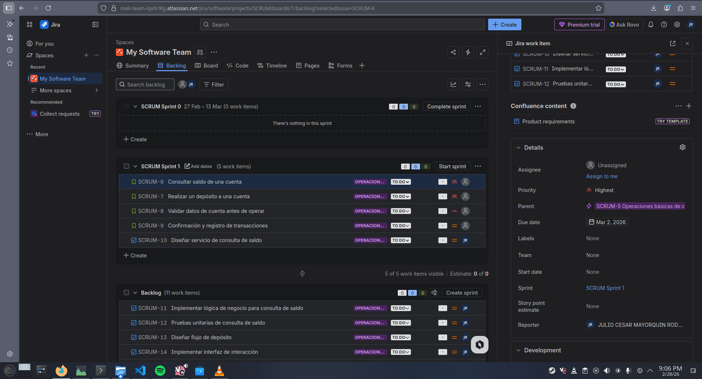

# 📄 Planeación del Sistema en Jira

## Desglose de trabajo: Épicas, Historias de Usuario y Tareas

La implementación de los requerimientos identificados de Bankify se desglosa de la siguiente manera:

### 1. Épica:

**ID Jira:** (Ej: BK-1)  
**Título:** Funcionamiento general de la plataforma Bankify  
**Descripción:** Permitir a los clientes realizar operaciones básicas sobre su cuenta bancaria como consultar saldo, realizar depósitos, validar datos y obtener confirmación de transacciones.  
**Fecha de vencimiento:** (Colocar la fecha indicada en el caso de estudio)

### 2. Historias de usuario:

### HU-01 – Consultar saldo de una cuenta
**ID Jira:** (Ej: BK-2)  
**Descripción:** Como cliente, quiero consultar el saldo de mi cuenta, para conocer cuánto dinero tengo disponible.

### HU-02 – Realizar un depósito a una cuenta
**ID Jira:** (Ej: BK-3)  
**Descripción:** Como cliente, quiero realizar un depósito a una cuenta, para agregar dinero de forma segura y controlada.

### HU-03 – Validar datos de cuenta antes de operar
**ID Jira:** (Ej: BK-4)  
**Descripción:** Como cliente, quiero que el sistema valide los datos de la cuenta antes de operar, para evitar errores y operaciones inválidas.

### HU-04 – Confirmación y registro de transacciones
**ID Jira:** (Ej: BK-5)  
**Descripción:** Como cliente, quiero recibir confirmación y que quede registro del depósito, para tener evidencia de la transacción.

### 3. Tareas:

### Tareas HU-01
- TR-01 – Diseñar servicio de consulta de saldo  
- TR-02 – Implementar lógica de negocio para consulta de saldo  
- TR-03 – Pruebas unitarias de consulta de saldo  

### Tareas HU-02
- TR-04 – Diseñar flujo de depósito  
- TR-05 – Implementar interfaz de interacción  
- TR-06 – Pruebas unitarias de depósito  

### Tareas HU-03
- TR-07 – Validar formato de número de cuenta  
- TR-08 – Validar banco registrado  
- TR-09 – Validar estado de cuenta  

### Tareas HU-04
- TR-10 – Definir estructura del registro  
- TR-11 – Implementar guardado del registro  
- TR-12 – Implementar confirmación al usuario

### 4. Cronograma:

### 5. Backlog:

